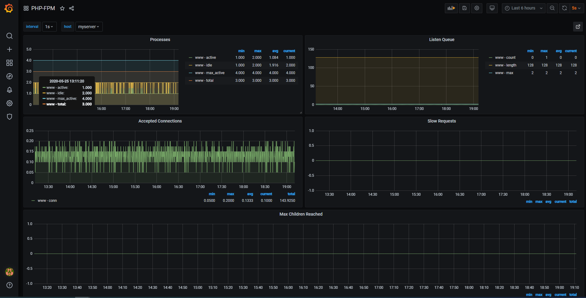

# php-fpm-monitoring
#


## php-fpm installation

https://www.cloudbooklet.com/how-to-install-php-fpm-with-apache-on-ubuntu-18-04-google-cloud/
#
Edit `/etc/php/7.2/fpm/pool.d/www.conf`
```hcl
...
[www]

user = www-data
group = www-data

listen = IP_ADRESS:9000
listen.owner = www-data
listen.group = www-data

pm = dynamic

pm.status_path = /status

```

Edit `/etc/apache2/mods-available/fastcgi.conf`

```hcl
<IfModule mod_fastcgi.c>
        # Define a named handler
        AddHandler php7-fcgi .php
        # Generate an alias pointing to /usr/lib/cgi-bin/php[VersionNumber]-fcgi
        Alias /php7-fcgi /usr/lib/cgi-bin/php7-fcgi
        # Configure an external server handling your upcoming requests (note where the alias is pointing towards)
        FastCgiExternalServer /usr/lib/cgi-bin/php7-fcgi -socket /var/run/php/php7.0-fpm.sock -pass-header Authorization

         # only on if fpm-status is match. You might want to put this into your concrete vhost.conf file. For the testing, fastcgi.conf should work.
         <LocationMatch "/status">
             # set the before defined handler here
             SetHandler php7-fcgi
             # use the handler for the action handling virtual requests
             Action php7-fcgi /php7-fcgi virtual
         </LocationMatch>
</IfModule>

```
Edit `/etc/apache2/sites-enabled/000-default.conf`

```hcl
<VirtualHost *:80>
        
        ServerAdmin webmaster@localhost
        DocumentRoot /var/www/html

        <FilesMatch "\.php$">
        SetHandler "proxy:fcgi://127.0.0.1:9000/"
        </FilesMatch>

        ErrorLog ${APACHE_LOG_DIR}/error.log
        CustomLog ${APACHE_LOG_DIR}/access.log combined
       
</VirtualHost>

```


## Influxdb installation 
https://docs.influxdata.com/influxdb/v1.5/introduction/installation/

Debian 9
```hcl
curl -sL https://repos.influxdata.com/influxdb.key | sudo apt-key add -
echo "deb https://repos.influxdata.com/debian stretch stable" > /etc/apt/sources.list.d/influxdata.list
apt-get update
apt-get install influxdb
systemctl start influxdb
```
### Configure InfluxDB
```hcl
root@server ~# influx
Connected to http://localhost:8086 version 1.5.1
InfluxDB shell version: 1.5.1
```
Create the database
```hcl
> CREATE DATABASE telegraf
> SHOW DATABASES
name: databases
name
----
_internal
telegraf
```
Create a user. Choose a good password as InfluxDB will be exposed to the internet
```hcl
> CREATE USER telegraf WITH PASSWORD 'password'
> GRANT ALL ON telegraf TO telegraf
> SHOW USERS;
user     admin
----     -----
telegraf false
```
You can setup a retention policy if you wish

```hcl
> CREATE RETENTION POLICY thirty_days ON telegraf DURATION 30d REPLICATION 1 DEFAULT
> SHOW RETENTION POLICIES ON telegraf
name		duration	replicaN	DEFAULT
DEFAULT		0		1		FALSE
thirty_days	720h0m0s	1		TRUE
```
#
## Telegraf installation 
https://docs.influxdata.com/telegraf/v1.14/introduction/installation/

### Configure Telegraf

I suggest you to read it, but here's a quick start on what you can add in /etc/telegraf/telegraf.conf.
Agent configuration
```hcl
[agent]
  hostname = "myserver"
  flush_interval = "15s"
  interval = "15s"
```
By default, the hostname will be the server hostname (makes sense), and the metrics will be collected every 10 seconds.

Inputs configuration

```hcl
[agent]
  hostname = "myserver"
  flush_interval = "15s"
  interval = "15s"

[[inputs.cpu]]

[[inputs.mem]]

[[inputs.system]]

[[inputs.disk]]
  mount_points = ["/"]

[[inputs.processes]]

[[inputs.net]]
  fieldpass = [ "bytes_*" ]
  
[[inputs.phpfpm]]
  urls = ["fcgi://127.0.0.1:9000/status"]
  
[[outputs.influxdb]]
  database = "telegraf"
  urls = [ "http://127.0.0.1:8086" ]
  username = "telegraf"
  password = "scloud!"

```
### You can see what Telegraf collects with this command
```hcl
telegraf -test -config /etc/telegraf/telegraf.conf
```

This is very useful when adding new plugins
```hcl
ubuntu@ip-10-1-2-236:/etc/apache2$ telegraf -test -config /etc/telegraf/telegraf.conf --input-filter phpfpm
2020-05-25T12:14:44Z I! Starting Telegraf 1.14.3
> phpfpm,host=myserver,pool=www,url=fcgi://127.0.0.1:9000/status accepted_conn=92413i,active_processes=1i,idle_processes=2i,listen_queue=0i,listen_queue_len=128i,max_active_processes=4i,max_children_reached=0i,max_listen_queue=2i,slow_requests=0i,start_since=270772i,total_processes=3i 1590408884000000000
```
#
## Grafana


